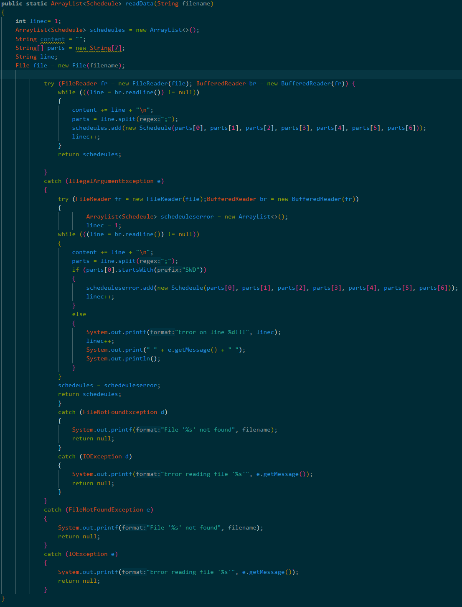
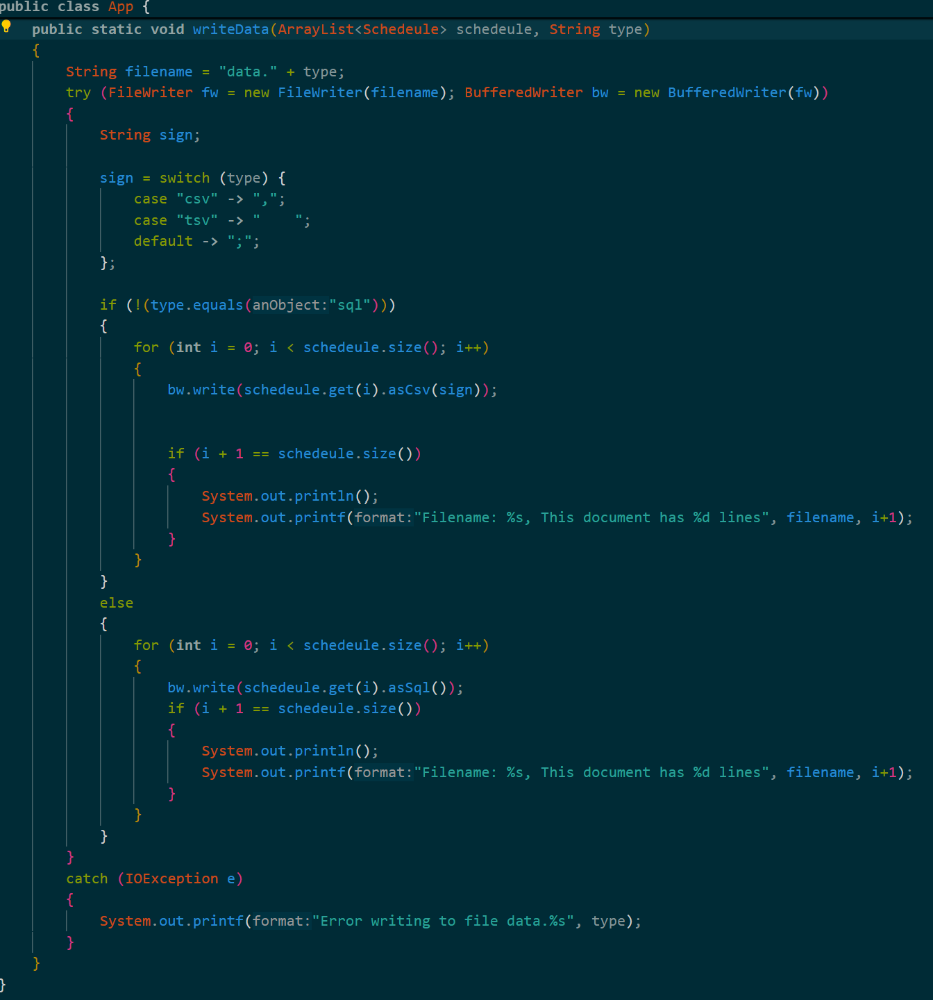
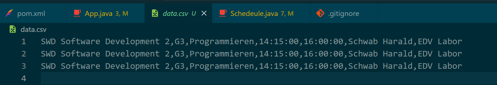

# Import Export Project

## Description

1. A Method that reads a file (a text) and returns an Array List with the Schedeules in the file with error checking. (``readData`` Method).

2. A Method that writes a file (depending on the type chosen).

3. It returns different results depending on the type, a **"sql"** returns a sql like structure, a **"csv"** type returns the attributes with a comma betwenn them and a **"tsv"** with a tab between them.

4. It also prints on the terminal how many lines the document has and the name of it.

## Notes

- The file should be designed in a way for the reader Method ``readData`` to read: Example:

> SWDCohort3;group3;lecture3;starts3;ends3;lecturer3;place3
>
> SWDCohort;group;lecture;starts;ends;lecturer;place

- It should seperate the attributes with a ";".
- The Elements of Schedeule are:

> ```
>      private String cohort;
>      private String group;
>      private String lecture;
>      private String starts;
>      private String ends;
>      private String lecturer;
>      private String place;
>```

- These are also the attributes used in The file that is being read by the ``readData`` Method.
- That it creates a breakline is because of the Methods in the ``Schedeule.java`` class, the ``asCsv`` and the ``asSql`` Methods both make it possible to read the attributes of the Schedeule Object.

## Pictures


>
>this is the ``readData`` Method (above).
>

>
>this is the ``writeData`` Method (above).
>

>
>this is an example result of the ``writeData`` Method (when **type="csv"** is used).
>
